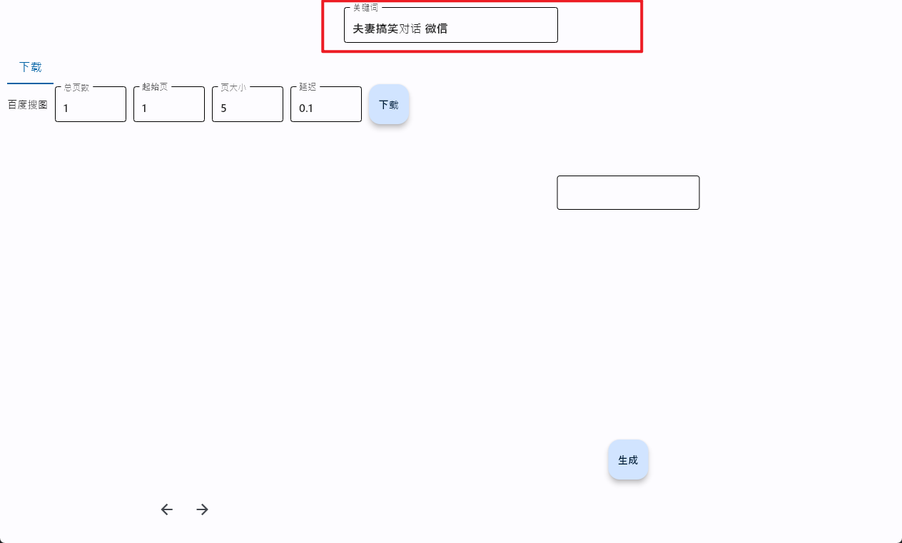
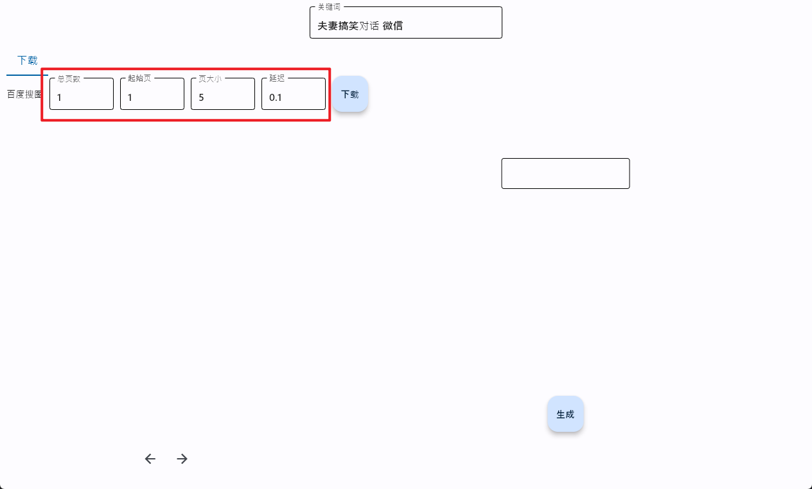
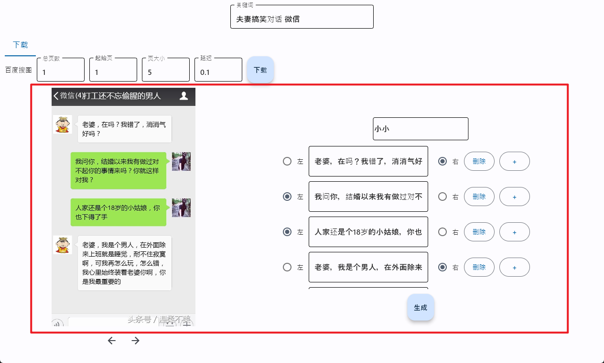
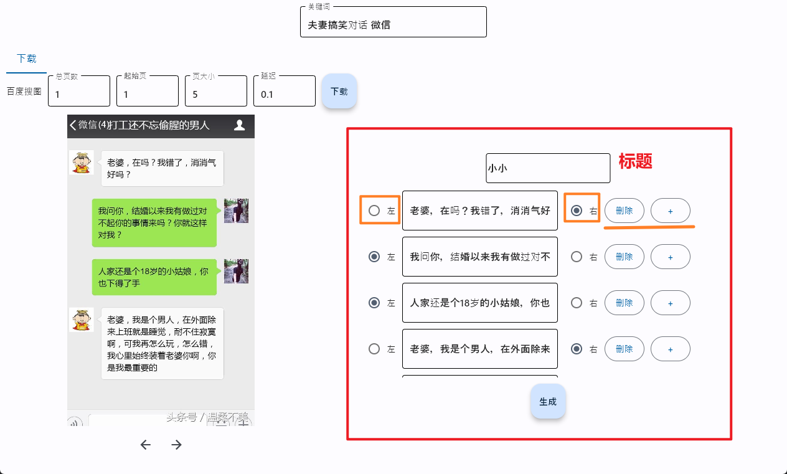

<h1 align="center">wechat-video-generate</h1>

  
  
  

___

## 微信对话视频一键生成器
### 使用方法
1. 下载本项目代码
2. 安装requirements.txt环境
3. 执行main.py文件

### 使用教程
1. 填写关键字

2. 填写要下载的图片数量，并点击下载

3. ocr会进行文字识别并展示

4. 手动修改ocr识别不准确的地方

5. 点击生成，等待生成完成

### 也可以使用[release](https://github.com/cuifengcn/wechat-video-generate/releases)中打包好的文件

### 参考项目
[short-video-generate](https://github.com/ayuLiao/short-video-generate)

[weixin-chat](https://gitee.com/lifeixue/weixin-chat)
